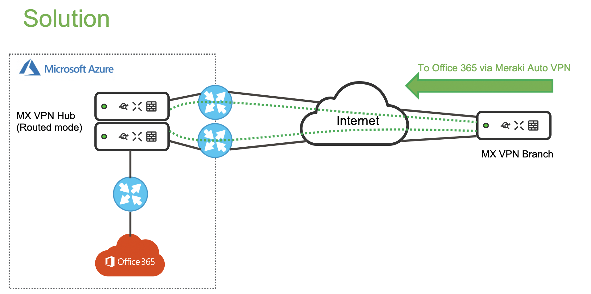
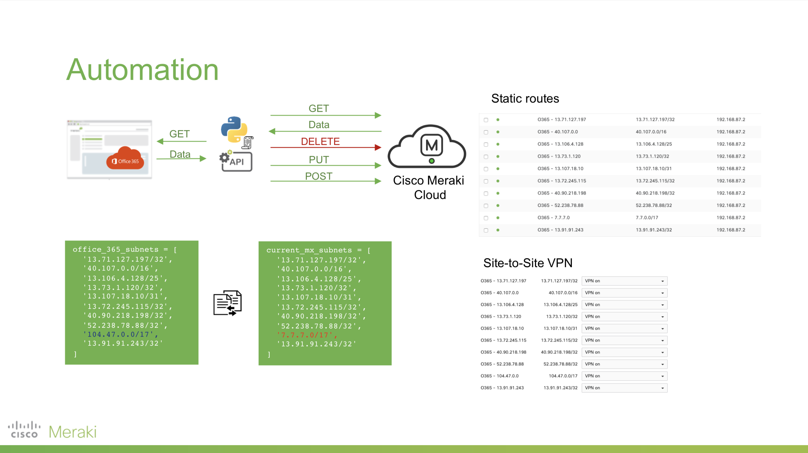

# Performance-based routing to MS Office 365 over Cisco Meraki SD-WAN.

## Objective

***What does the script do?***

This script optimises routing to Microsoft Office 365 for Cisco Meraki SD-WAN solution.

***How does the script do it?***

Constantly checks MS online documentation, fetches up-to-date routes and automatically injects them into VPN Hub.
As a result, performance-based routing to Office 365 is enabled.

Implementation:
- The script retrieves up-to-date MS Office 365 IP addresses from the official Microsoft online documentation, 
- Compares with currently configured IP addresses, 
- Injects the new routes to Meraki Auto VPN, 
- Deletes outdated routes from Meraki Auto VPN.

[Presentation](https://drive.google.com/file/d/1rs0msxhX5km2pTcq6rHoc_U8IgaeIDB1/view?usp=sharing)

## Installation

'''pip install meraki_sdk'''

## Usage

This script has to be applied on the VPN Hub in VPN concentrator mode (the only supported mode).

The script must be executed with the following flags:

1. API Key (-a): 
2. Default gateway (-g):
3. NetworkID (VPN Concentrator) (-n):
	- Get your OrganisationID:
	https://dashboard.meraki.com/api/v0/organizations
	- Get your NetworkID:
	https://dashboard.meraki.com/api/v0/organizations/{OrganisationID}/networks
	
Important note:
The script injects routes with the description "O365 - X.X.X.X". It is important to make sure that these descriptions are not modified and there are no other descriptions contain the prefix "O365"

Example:
python3 o365_sd_wan.py -a {API key} -n {NetworkID} -g {IP address}

